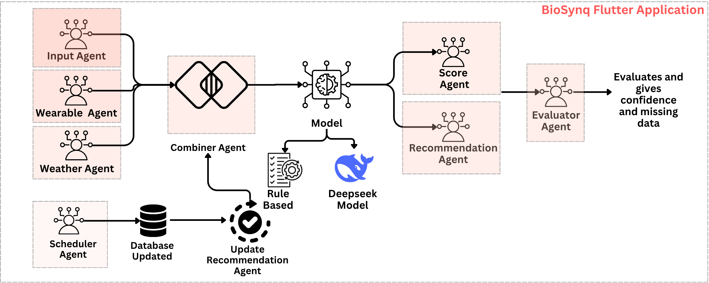
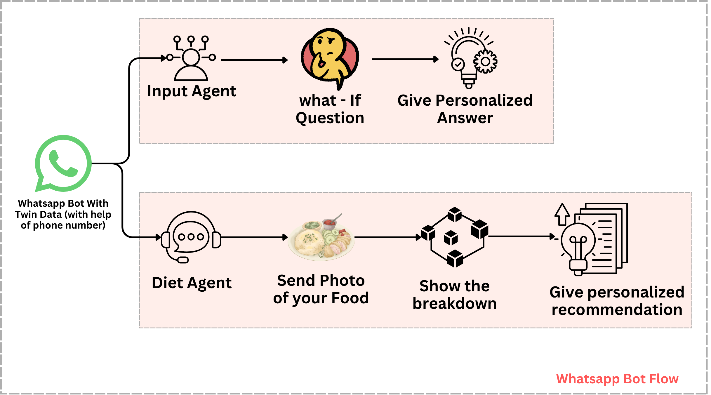

<p align="center">
  
</p>

# 🧬 Cognitive Health Twin

> **Shift healthcare from reactive treatment → proactive prevention** with a continuously evolving, AI-driven personal health companion.

---

## 📌 Table of Contents

- [Overview](#-overview)
- [Key Capabilities](#-key-capabilities)
- [System Architecture](#-system-architecture)
- [Agentic AI Approach](#-agentic-ai-approach)
- [Tech Stack](#-tech-stack)
- [API Reference](#-api-reference)
- [Authentication](#-authentication)
- [Getting Started](#-getting-started)
- [Limitations](#️-current-limitations)
- [Roadmap](#-future-roadmap)
- [Vision](#-vision)

---

## 🚀 Overview

Traditional healthcare is **reactive** — people act only after symptoms appear. **Cognitive Health Twin** changes this paradigm by introducing a dynamic, evolving digital representation of an individual's health.

By combining:

- 🏥 Personal health data
- 🏃 Lifestyle habits
- ⌚ Wearable device data
- 🤖 AI-driven reasoning

...the system enables **preventive, personalized healthcare decisions** before problems arise.

---

## 🧠 Key Capabilities

### 1. 🧑‍💻 Digital Health Twin
Maintains a continuously updated profile including physical, behavioral, and environmental data — your health, mirrored in real time.

### 2. 📊 Risk Scoring Engine
Computes health risk levels (e.g., diabetes, cardiovascular disease) using structured deterministic logic based on user inputs.

### 3. 💡 AI Insights Engine
Uses a large language model to convert raw health data into:
- Easy-to-understand insights
- Actionable, personalized recommendations

### 4. 🔮 What-If Simulation Engine
Allows users to explore future health scenarios such as:
- *"What if I walk 8,000 steps daily?"*
- *"What if I improve my sleep to 8 hours?"*

Predicts the impact on health risks before you commit to a change.

### 5. ⌚ Wearable Integration
Fetches real-time health data — steps, heart rate, sleep — from fitness platforms and syncs it with the user's health twin.

### 6. 💬 WhatsApp Chatbot Interface
Enables users to interact with the system conversationally — run simulations, get instant insights, and manage their health twin — all from WhatsApp.

---

## 🧩 System Architecture

The system follows a **modular, agent-based architecture**:

<p align="center">
  
</p>
<p align="center">
  
</p>

---

## 🤖 Agentic AI Approach

Instead of relying on a single monolithic LLM call, the system is designed as a **tool-based agent architecture**:

| Agent | Responsibility |
|---|---|
| **Data Agent** | Collects and normalizes user + wearable data |
| **Scoring Agent** | Computes deterministic health risk scores |
| **Simulation Agent** | Predicts future health outcomes from scenarios |
| **Insights Agent** | Generates human-readable explanations via LLM |

Each module acts as a **specialized agent** in a multi-step reasoning pipeline:

```
Data Collection → Risk Evaluation → Prediction → Insight Generation
```

This structure enables **scalable and interpretable intelligence**, and is designed to evolve into a fully autonomous agent system.

---

## 🛠️ Tech Stack

| Layer | Technology |
|---|---|
| **Backend** | Flask (Python) |
| **Database** | MongoDB |
| **AI Model** | DeepSeek via Featherless API |
| **Wearables** | Google Fit / Wearable Platforms |
| **Interface** | REST APIs + WhatsApp Bot |
| **Auth** | Mobile number-based login + secure token system |

---

## 📡 API Reference

### 🔐 Auth APIs

| Endpoint | Method | Description |
|---|---|---|
| `/auth/register` | `POST` | Register a new user |
| `/auth/login` | `POST` | Login and receive a secure token |

### 👤 Twin APIs

| Endpoint | Method | Description |
|---|---|---|
| `/twin/create` | `POST` | Create a new health twin profile |
| `/twin/update` | `PUT` | Update existing health profile |

### 📊 Scoring API

| Endpoint | Method | Description |
|---|---|---|
| `/scoring/generate` | `POST` | Generate health risk scores |

### 💡 Insights API

| Endpoint | Method | Description |
|---|---|---|
| `/insights/get` | `GET` | Fetch AI-based recommendations |

### 🔮 Simulation API

| Endpoint | Method | Description |
|---|---|---|
| `/simulation/run` | `POST` | Run a what-if health scenario |

### ⌚ Wearables API

| Endpoint | Method | Description |
|---|---|---|
| `/wearables/sync` | `POST` | Sync data from fitness platforms |

### 💬 WhatsApp Webhook

| Endpoint | Method | Description |
|---|---|---|
| `/webhook/whatsapp` | `POST` | Handle incoming WhatsApp messages |

---

## 🔐 Authentication

- Mobile number-based login
- Secure token system (token passed in request headers)
- No sensitive health data is exposed externally

---

## 🚀 Getting Started

### Prerequisites

- Python 3.9+
- MongoDB running locally or via Atlas
- Featherless API key (for DeepSeek LLM access)

### Installation

```bash
# Clone the repository
git clone https://github.comhahaanisha/engima_team_inspire.git
cd engima_team_inspire

# Create a virtual environment
python -m venv venv
source venv/bin/activate  # On Windows: venv\Scripts\activate

# Install dependencies
pip install -r requirements.txt
```

### Configuration

Create a `.env` file in the root directory:

```env
MONGO_URI=mongodb://localhost:27017/health_twin
FEATHERLESS_API_KEY=your_api_key_here
SECRET_KEY=your_jwt_secret
WHATSAPP_VERIFY_TOKEN=your_webhook_verify_token
```

### Run the Application

```bash
flask run
```

The API will be available at `http://localhost:5000`.

---

## 💡 Unique Selling Points

- ✅ Combines **digital twin** concepts with **AI reasoning**
- ✅ Goes beyond insights — **predicts future health outcomes**
- ✅ Hybrid approach:
  - **Deterministic logic** for accuracy
  - **LLM reasoning** for intelligence
- ✅ **Real-time adaptive** system using live wearable data
- ✅ Accessible via **WhatsApp** — no app download required

---

## ⚠️ Current Limitations

- Wearable data availability depends on device and app integration support
- Agent orchestration is currently **rule-based** (not fully autonomous)

---

## 🔮 Future Roadmap

- [ ] Fully autonomous agent controller
- [ ] Health Connect integration (post Google Fit deprecation)
- [ ] Advanced ML-based risk prediction models
- [ ] Long-term health trend tracking and analytics
- [ ] Personalized intervention planning and goal tracking
- [ ] Multi-language support for global accessibility

---

## 🎯 Vision

> **Empowering individuals with a continuously evolving AI-driven health companion** — so that everyone can make informed, proactive decisions about their wellbeing before problems arise.

We believe the future of healthcare is not in hospitals after illness strikes, but in intelligent systems that help people stay healthy every day.
---
## Contact: 
<p align="left">
  <a href="mailto:teaminspire2226@gmail.com">
    
  </a>
</p>

- [Tejas Gadge](https://www.linkedin.com/in/tejas-gadge-8a395b258/)
- [Anisha Shankar](https://www.linkedin.com/in/anisha-shankar-/)
- [Ganesh Shelar](https://www.linkedin.com/in/ganesh-shelar-2190ab294/)
